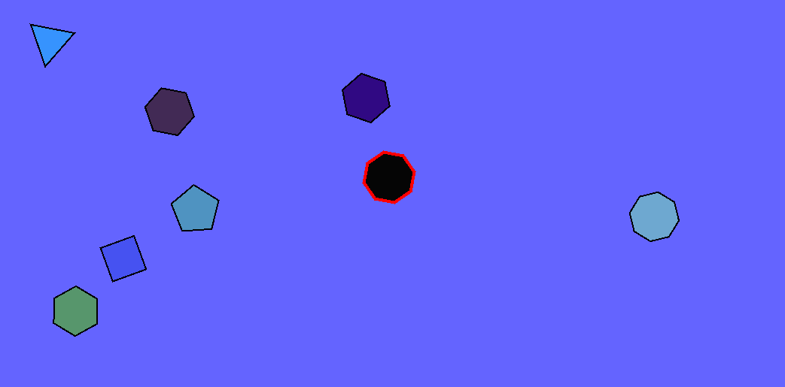

# CppAplications

Here you will find some projects I have created in C++.

<h1>Contributions by AURELIO RODRIGUES</h1>

<h4>I have made significant contributions to this project. Follow the functions I had worked on:</h4>

- `Game::sUserInput()`: Handling user input in the game.
- `Game::sMovement()`: Managing in-game entity movement.
- `Game::sRender()`: Handling the rendering of game entities.
- `Game::loadConfigFromFile()`: Loading configuration data from a file.
- `Game::sCollision()`: Implementing collision detection and response.
- `Game::keepObjectsInBounds()`: Ensuring game objects stay within defined bounds.
- `Game::adjustPlayerPosition()`: Making adjustments to the player's position.
- `Game::spawnPlayer()`: Managing player character spawning.
- `Game::sLifespan()`: Handling the lifespan of in-game entities.
- `Game::spawnEnemy()`: Implementing the spawning of enemy entities.
- `Game::spawnSmallEnemies()`: Managing the spawning of small enemy units.
- `Game::spawnBullet()`: Handling bullet spawning.
- `Game::spawnSpecialWeapon()`: Managing the spawning of special weapons.

These contributions were instrumental in the development of this project.
